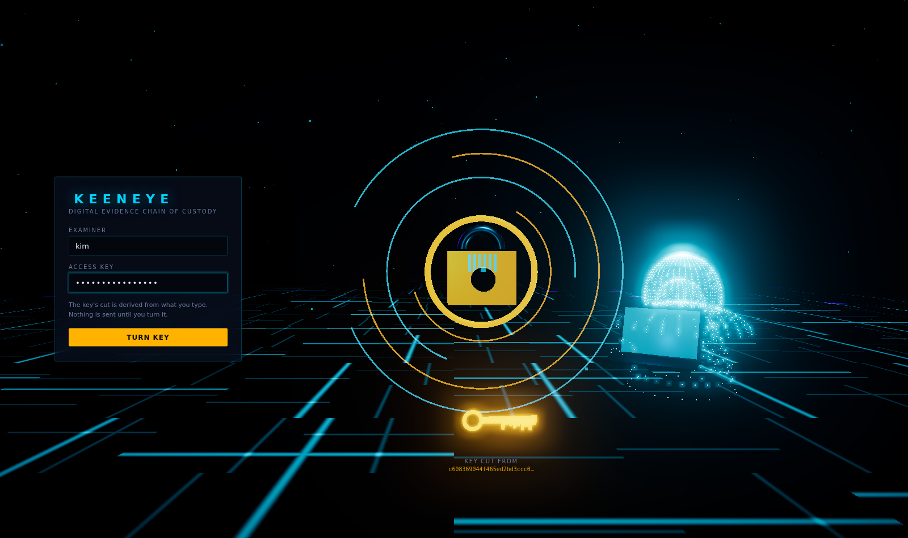
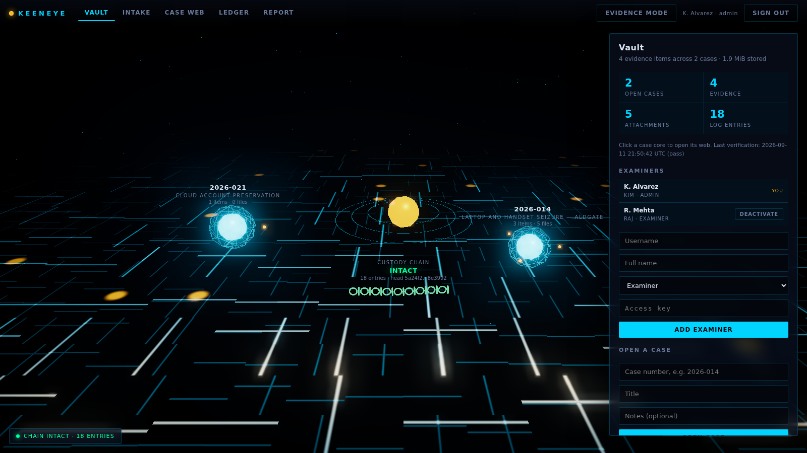
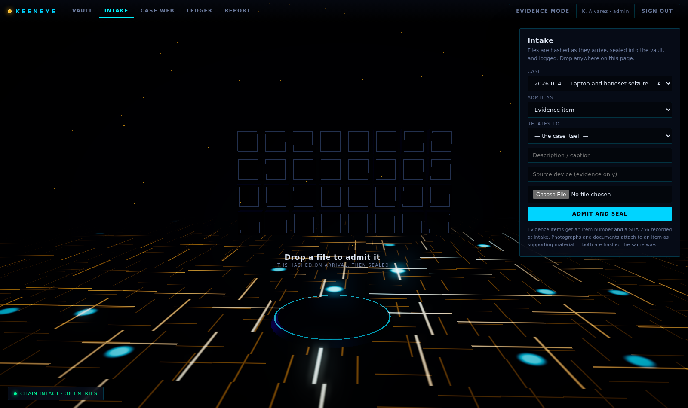
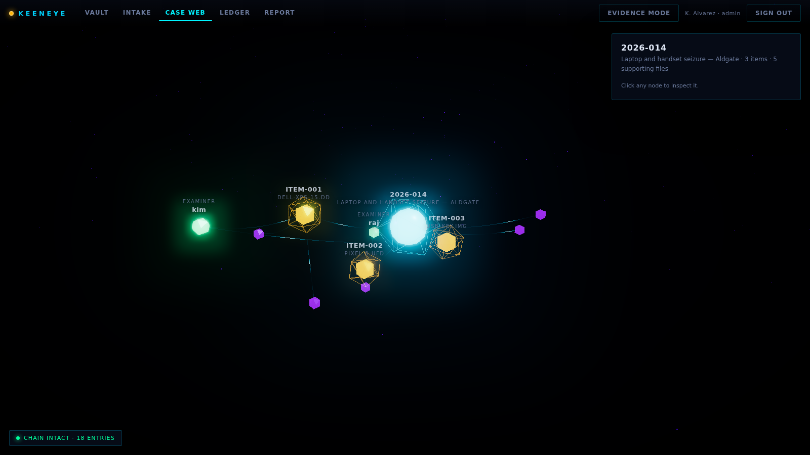
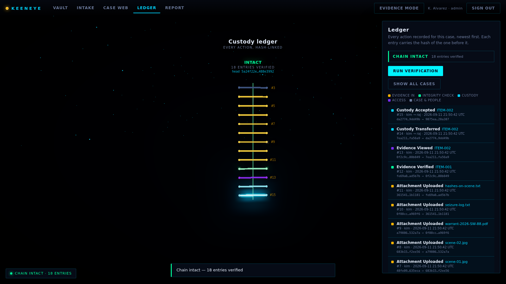

# KEENEYE

**Chain-of-custody tracker for digital evidence.** Hashes every file on intake, records every action
in a tamper-evident append-only log, and exports a court-ready audit trail — with a 3D examiner
interface and a command line that share one engine and one log.

<p align="center">
  
</p>

---

## The idea in one paragraph

A chain of custody is not a hash. It is the record of who touched a piece of evidence, when, and what
they did to it — and that record is only worth anything if you can show it has not been edited since.
KEENEYE hashes evidence with SHA-256 the moment it arrives, stores it read-only under its own digest,
and writes every subsequent action into a log where **each entry contains the hash of the entry before
it**. Altering any historical entry breaks the arithmetic of every entry that follows, at a position
the tool can name. It cannot prevent tampering. It makes tampering impossible to do quietly.

## Run it

```bash
git clone https://github.com/anizum1/Keeneye1.git && cd Keeneye1
python3 -m venv .venv && source .venv/bin/activate
pip install -r requirements.txt

python -m coc init                                          # create a workspace
python -m coc user add --username you --role admin          # prompts for an access key
python -m coc serve                                         # http://127.0.0.1:5000
```

Nothing is hosted, nothing phones home, and three.js is vendored into the repository — the whole
application runs on a workstation with the network cable pulled out. That is deliberate: evidence
handling tools have no business shipping data anywhere.

Want something to look at first? `python tools/seed_demo.py` builds a populated demo workspace
(sign in as `kim`, access key `open-sesame-2026`), then `python -m coc serve --workspace workspace-demo`.

### Using it on real files

```bash
# Look before you leap: hashes everything, writes nothing.
python -m coc import ~/work/vendor-dispute --case 2026-100 --recursive --dry-run --as you

# Then do it for real. Re-running skips anything already in the case.
python -m coc import ~/work/vendor-dispute --case 2026-100 --recursive --as you

# Copy the workspace somewhere else and verify the copy, not the original.
python -m coc backup --out /mnt/backup/keeneye-2026-09-11 --deep
```

Intake records the **source file's own modification and creation times** alongside the hash, read
before the file is vaulted. They are shown and printed as *reported by the source*, never as proven —
anyone holding a file can set them, so only the SHA-256 attests to content. See
[docs/STANDARDS.md](docs/STANDARDS.md).

Keep real material out of the repository. `.gitignore` covers the vault, the database, `.env`, and any
directory whose name mentions a case, evidence or exhibits — plus `private/` and `incoming/` as
explicit quarantine. Better still, keep the workspace outside the repo entirely:
`python -m coc --workspace ~/keeneye-work serve`.

### The same tool without a browser

```bash
python -m coc case open 2026-014 "Laptop seizure — Aldgate" --as you
python -m coc evidence add ./dell-xps-15.dd --case 2026-014 --as you \
       --source-device "Dell XPS 15, S/N 7HX2K9"
python -m coc attach ./scene-01.jpg --case 2026-014 --evidence 1 --kind photo --as you
python -m coc verify --case 2026-014 --as you      # re-hash and compare
python -m coc chain verify                          # walk the whole log
python -m coc report 2026-014 --as you              # the court PDF
python -m coc import ./folder --case 2026-014 --as you --dry-run
python -m coc backup --out ~/keeneye-backup --deep
```

Both front-ends call the same service layer, so an action taken in the terminal appears in the 3D
ledger and vice versa. Exit code `2` means specifically *an integrity check failed*, so a scheduled
job can tell that apart from the tool falling over.

---

## What it does

### Hashes on arrival, and stores by hash

Evidence is hashed while it streams in — a multi-gigabyte image is never held in memory — and written
into a content-addressed vault at `vault/sha256/ab/cd/<digest>`, chmod `0444`. The path *is* the
integrity claim: a file cannot sit at the wrong address. Identical content is stored once. The
original filename never touches the filesystem, so a name like `../../etc/passwd` is data, not a path.

SHA-256 is the primary digest. SHA-1 is recorded alongside it for interoperability with older case
files and is never used on its own to decide whether something is intact ([SWGDE](#standards)).

### Keeps photographs, documents and raw files with the evidence

Scene photographs, warrants, seizure notes, write-blocker output — all hashed and vaulted exactly like
evidence, attached to the item they support, and **each upload is itself a logged, auditable act**.
They live in a separate table because they are *about* the evidence rather than being the evidence,
and a court report has to be able to tell the difference.

### Logs everything, append-only

```
entry_hash = SHA256( canonical_json(entry fields) || previous entry_hash )
```

SQLite triggers abort any `UPDATE` or `DELETE` against the custody log. That stops the *application*
from rewriting history; it does not stop someone with the `.sqlite` file and a shell. The hash chain
is what makes that detectable — and the tool says so out loud rather than implying the triggers are a
security boundary. See [docs/DESIGN.md](docs/DESIGN.md), including what the chain **cannot** prove.

### Proves it

```
$ python tools/tamper_demo.py

── ATTACK 1 — alter the evidence file on disk ────────────────────────
  Removing the read-only bit and flipping one byte in the middle…
  byte 220,000: 0x00 → 0x01  (1 bit changed in 440,000 bytes)
  DETECTED — ITEM-001 failed verification
    recorded  86f99da0d32d0fa7b00ee08faf0a7c66bc8d904ef0e15e8dbf43a3d3a44e5499
    observed  19091794348f85cb682d2be9cbf4665df1c1769d80fcee99625ba4d51b092084
  The failure was written to the log as entry #9 (check result: FAIL).

── ATTACK 2 — rewrite a custody entry in the database ────────────────
  The application cannot do this — the triggers refuse:
    sqlite3.IntegrityError: custody_log is append-only: UPDATE is not permitted
  So do it the way an attacker would: raw connection, drop the triggers.
    entry #7: actor_username rewritten to 'someone_else'
  DETECTED — chain BROKEN
    first broken entry  #7
    reason  entry 7 has been altered: contents hash to 25a10d0d… but the log records fe7f0d16…
```

A failed integrity check is written to the log exactly like a passing one. An integrity tool that only
records its successes is worse than useless.

---

## The interface

One WebGL canvas for the whole application. The six views are not separate pages — they are regions at
fixed positions in a single continuous space, and navigating flies the camera between them. The browser
never reloads, because a page navigation would tear down the context and with it the sense that the
vault is a place rather than a set of screens.

| | |
|---|---|
| **The Vault Door** — sign in. The key's teeth are cut from a live SHA-256 of what you type, computed in the browser and never sent anywhere. Turning it drops the tumblers, aligns the rings and lifts the shackle. |  |
| **The Vault** — cases orbit above a circuit-board floor. Running through the room is the chain spine: one link per custody entry, green while the log verifies, fractured red at the entry that broke. |  |
| **The Forge** — drop a file anywhere on the page. A ring wraps it while it is hashed, driven by real upload progress rather than a timer pretending to be one; then the slab flies into a cell in the lattice and the lock seats. |  |
| **The Web** — every document, photograph and evidence item hangs off its case on a glowing filament, laid out by a live force simulation. |  |
| **The Ledger** — the custody log as a physical chain, each block carrying its two hashes. Verification fires a pulse from the genesis block; on a broken chain it stops dead at the fracture. |  |

### Chaotic but harmonious

The case web is not decorative motion. Three forces act at once: nodes repel each other (the chaos),
filaments pull like springs (the structure), and a harmonic term draws each node toward the radius of
the shell its kind belongs on — case at the centre, evidence around it, attachments outside those,
examiners on the rim. The field writhes and always resolves into concentric order instead of
collapsing into a knot or flying apart. Layouts are seeded from the case number, so the same case
always lays out the same way: an examiner has to be able to say "the node on the left" twice.

### Evidence mode

A fully 3D interface fights the thing that makes a forensic tool credible. So there is a plain view —
high-contrast DOM tables, printable, screen-reader-navigable — selected automatically when WebGL is
unavailable or the operating system asks for reduced motion, and reachable any time from the toolbar.
It is **not a degraded copy with different data**: it runs on exactly the same JSON API, so the two
views can never disagree about what the log says.

The 3D world is how an examiner works. The PDF is what leaves the building, and it is deliberately
plain.

---

## How it is built

```
coc/
  hashing.py    chunked SHA-256 / SHA-1                    ← the foundation
  db.py         schema, foreign keys, WAL, append-only triggers
  chain.py      canonical serialization, entry_hash, verify()
  storage.py    content-addressed write-once vault
  auth.py       PBKDF2-HMAC-SHA256 examiner identities
  service.py    THE ONLY WRITE PATH — every change and its log entry share one transaction
  report.py     the court PDF
  cli.py        the terminal front-end
  web/          Flask: a JSON API, file delivery, and the shell that boots the 3D world
    static/js/  three.js scenes, ~3k lines, no build step
```

Everything writes through `service.Workspace`. A row and its custody entry are inserted inside a single
`BEGIN IMMEDIATE` transaction, so there is no path — through the API, the CLI, or a bug — that records
a change without recording who made it.

**Four dependencies:** Flask, ReportLab, pytest, ruff. Everything else is the standard library.
three.js is vendored under `coc/web/static/vendor` by `tools/vendor_three.py`, which walks the
transitive closure of relative imports from the modules actually used — 18 files, 1.4 MB, no npm and
no build step. `pip install -r requirements.txt` is the entire setup.

### Tests

```bash
pytest -q          # 139 tests
ruff check .
```

The suite covers the properties that matter rather than line counts: that a single flipped bit changes
a digest; that chunk size never changes it; that every hashed field is actually covered by the chain;
that editing an entry is caught **at the exact sequence number**; that the append-only triggers fire;
that a failed write leaves no orphaned log entry; that an SVG is never served inline; that the exit
code for an integrity failure is distinct.

`tests/test_browser.py` drives the real interface in Chromium — it checks that the key's cut is
genuinely `sha256(what you typed)`, that a rejected credential does not open the lock, that navigating
leaves exactly one region drawn, and that a file uploaded through the 3D intake ends up sealed with the
real digest of its bytes. It skips itself when Playwright or a browser is unavailable.

---

## Standards

Design decisions are mapped to the documents that govern them in
**[docs/STANDARDS.md](docs/STANDARDS.md)** — NIST SP 800-86, NIST SP 800-101r1, ISO/IEC 27037, and
SWGDE guidance on hashing and evidence handling — including the requirements this tool does **not**
meet and would need to before anything like real use.

**[docs/DESIGN.md](docs/DESIGN.md)** covers the tamper-evidence design, the threat model, and its
limits: what a hash chain proves, what it does not, and why the court report pins the chain head.

---

## Status

A portfolio project, built to mirror how Digital Evidence Management Systems actually work. It is not
accredited, has not been validated against a reference dataset, and should not be used on real
casework. The limitations are written down in the two documents above rather than left for someone to
discover.

MIT licensed. See [LICENSE](LICENSE).
