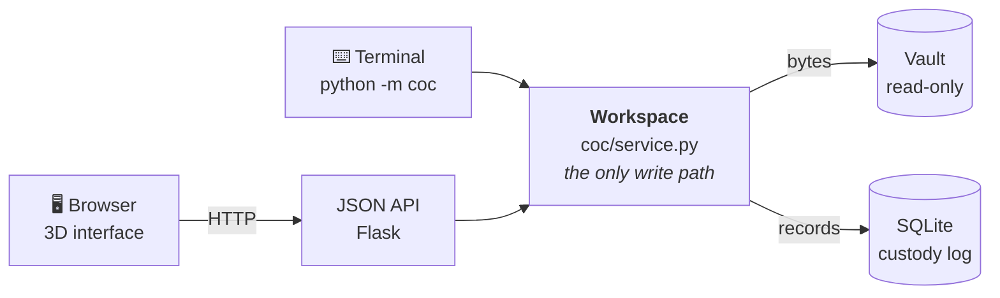
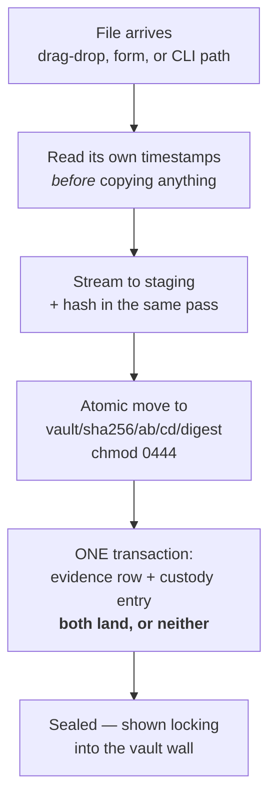
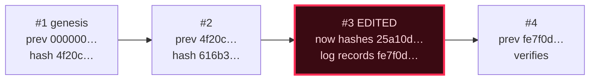

<h1 align="center">KEENEYE</h1>

<p align="center">
  <strong>Chain-of-custody tracker for digital evidence.</strong><br>
  Hashes every file on intake, records every action in a tamper-evident append-only log,
  and exports a court-ready audit trail — with a 3D examiner interface and a command line
  that share one engine and one log.
</p>

<p align="center">
  
</p>

---

## The problem it solves

If you handle documents that might later be questioned — a contract dispute, an internal
investigation, an incident response, a client's records — you eventually face a question you cannot
answer from a folder on a shared drive:

> *Can you show this file is the same one you received, and account for everyone who touched it since?*

A folder cannot answer that. Neither can a spreadsheet, because a spreadsheet can be edited without
a trace. What is missing is not storage — it is **evidence about the evidence**.

KEENEYE addresses four specific gaps:

| Problem | What KEENEYE does |
|---|---|
| **"Is this the same file?"** | SHA-256 the moment it arrives, stored read-only under its own digest. Re-check any time. |
| **"Who touched it, and when?"** | Every action — viewed, downloaded, verified, transferred — written to an append-only log attributed to a named examiner. |
| **"Has the record been edited since?"** | Each log entry carries the hash of the entry before it. Altering any historical entry breaks the arithmetic at a position the tool can name. |
| **"Can I hand this to someone?"** | A plain PDF: evidence inventory with hashes, the full chronological log, and the integrity verdict stated in words. |

It cannot stop tampering. It makes tampering **impossible to do quietly** — which is the actual job.

---

## How it works

**[📊 Read the full architecture walkthrough →](docs/architecture.html)** *(open it locally — GitHub
shows HTML as source)*

### The shape



Both front doors converge before anything is written. A route, a CLI command, or a future feature
cannot reach the database on its own — which is what guarantees no change exists without a record of
who made it. An action taken in the terminal appears in the ledger in the browser, because there is
only ever one log.

### Admitting a file



Step 5 is the one everything rests on. There is no ordering of failures that leaves a file recorded
but unattributed.

### Why an edited log gives itself away

```
entry_hash = SHA256( canonical_json(entry fields) ‖ previous entry_hash )
```



**The detection is positional, not vague.** Only the edited entry fails — entry #4 still points at
the value the log *records* for #3 — so verification names `#3` exactly rather than casting doubt
over the whole log. The edit leaves no trace in the row. It leaves one in the arithmetic.

### Two checks that answer different questions

| Command | Question | What it does |
|---|---|---|
| `coc verify` | *Did the file change?* | Reads the bytes back off disk, re-hashes, compares to the digest recorded at intake |
| `coc chain verify` | *Did the log change?* | Recomputes every entry hash, checks linkage and sequence contiguity, names the first break |

Both write their result to the log **including when they fail**. A tool that records only its
successes is worse than none.

---

## Install

Two dependencies, no build step. three.js is committed into the repository, so the whole application
runs on a machine with the network cable pulled out.

### Windows (PowerShell)

Run these **one line at a time**. Do not chain with `&&` — Windows PowerShell 5.1 rejects it.

```powershell
cd $HOME\Documents
git clone https://github.com/anizum1/Keeneye1.git
cd Keeneye1
py -m venv .venv
.\.venv\Scripts\python.exe -m pip install -r requirements.txt
```

> **Never activate the virtual environment.** Calling `.\.venv\Scripts\python.exe` directly sidesteps
> the PowerShell execution policy, which is the single most common reason setup fails on Windows.
> If `py` is not recognised, Python is not on your PATH — reinstall from
> [python.org](https://www.python.org/downloads/) with **"Add python.exe to PATH"** ticked (it is off
> by default).

### macOS / Linux

```bash
git clone https://github.com/anizum1/Keeneye1.git && cd Keeneye1
python3 -m venv .venv && source .venv/bin/activate
pip install -r requirements.txt
```

### See it working straight away

```bash
python tools/seed_demo.py                              # builds a populated demo case
python -m coc serve --workspace workspace-demo
```

Open **http://127.0.0.1:5000** and sign in as `kim` / `open-sesame-2026`.

> **Port 5000 blocked?** Windows reserves 5000–5100 for Hyper-V and WSL on many machines, and Flask
> then fails to bind. Use `--port 8000`. Check with
> `netsh interface ipv4 show excludedportrange protocol=tcp`.

---

## Using it

### Start your own workspace

Keep it **outside** the repository, so real records can never reach a commit:

```bash
python -m coc init       --workspace ~/keeneye-work
python -m coc user add   --workspace ~/keeneye-work --username you --role admin
python -m coc serve      --workspace ~/keeneye-work
```

<p align="center">
  
</p>

### Admit files

Drop them anywhere on the page, or bulk-import a folder. **Always dry-run first** — it hashes
everything and reports exactly what would happen while writing nothing:

```bash
python -m coc import ~/work/vendor-dispute --case 2026-100 --recursive --dry-run --as you
python -m coc import ~/work/vendor-dispute --case 2026-100 --recursive --as you
```

Re-running skips anything already in the case, so you cannot accidentally create four item numbers
for one document.

<p align="center">
  
</p>

### See how a case fits together

Every document, photograph and evidence item hangs off its case on a glowing filament, laid out by a
live force simulation. Click any node to inspect it.

<p align="center">
  
</p>

### Read the custody log

The column shows the *shape* of the chain — one rung per entry, colour-coded by action. The panel
shows the *content*, as selectable text. Running a verification fires a pulse down the column that
stops dead at a fracture.

<p align="center">
  
</p>

### Verify, report, and back up

```bash
python -m coc verify --case 2026-100 --as you    # re-hash the files
python -m coc chain verify                       # walk the log
python -m coc report 2026-100 --as you           # the court PDF
python -m coc backup --out /mnt/backup/keeneye --deep
```

Backup snapshots the database with `VACUUM INTO` rather than copying it — a plain copy under WAL can
capture a torn state — then **verifies the copy** by walking its chain. A backup nobody checked is
not a backup.

> **The database and the vault are one unit.** Files are stored under their own digest, so the vault
> alone is a pile of anonymous blobs; `keeneye.sqlite` is what maps a digest back to a filename, a
> case, and its history. Back up both together, which is what `coc backup` does.

### Exit codes

`0` success · `1` the command failed · **`2` an integrity check failed** — so a scheduled job can
tell "the tool broke" apart from "the evidence does not verify".

### Prove the tamper-evidence yourself

```bash
python tools/tamper_demo.py
```

It flips one bit in a 440,000-byte vaulted file, then rewrites a log entry with the append-only
triggers dropped — the way someone with the database file would. Both are caught, the second named
to the exact entry. It exits non-zero if either goes undetected.

---

## Using it ethically

This tool makes records that look authoritative. That is precisely why it can be misused, and why a
few things are worth stating plainly.

**It records claims — it does not validate them.** A hash proves a file has not changed *since
KEENEYE saw it*. It says nothing about whether the file was genuine when it arrived. Source
timestamps are whatever the sending machine reported and can be set by anyone holding the file. Never
present either as proof of origin.

**Do not present unvalidated output as forensically sound.** This has never been tested against NIST
CFTT reference data, has no write blocker, and no cryptographic signing. It is suitable for internal
records and for learning. Representing its output as court-grade forensics, or yourself as
accredited on the strength of it, would be dishonest and could damage a real case.

**Only handle material you are authorised to handle.** Access to a file is not authority over it.
For workplace matters that usually means a documented instruction; for anything involving another
person's data it may mean a legal basis. Get that before ingesting, not after.

**Understand the privacy tension before you load personal data.** The append-only log and
content-addressed vault are deliberately built so nothing can be quietly removed — which is in direct
tension with a data subject's **right to erasure** under GDPR and similar regimes. There is no delete
command, by design. If you are putting personal data in, decide your retention and deletion approach
*first*, and be prepared to destroy an entire workspace rather than edit one out of it.

**Attribution is only as good as your key handling.** Every entry is signed to a username. Share an
access key and you have attributed someone else's actions to that person — which corrupts the one
thing the log exists to establish. One account per person; deactivate people who leave (accounts are
never deleted, so their history stays attributable).

**Do not use it to manufacture a paper trail.** Ingesting a document you altered earlier produces a
perfect, verifiable custody record of a falsified file. The tool will faithfully certify a lie. The
integrity guarantee starts at the moment of ingest and covers nothing before it.

**Report failures, not just passes.** If a verification fails, that failure is in the log and belongs
in your account of the matter. Suppressing it while relying on the tool's other output is the most
likely way this gets misused in practice.

---

## What it deliberately does not do

Listed with the same weight as the features, because a forensic tool that oversells itself is worse
than one that claims less.

- **A chain proves nothing was edited — not that nothing was removed from the end.** Truncate the log
  and the surviving prefix stays consistent. The court report prints the chain head at generation
  time; a dated report that has left the building is what makes a later truncation visible.
- **Entries are chained but not signed.** Anyone who can write to the database can append a *valid*
  new entry under any username. Per-examiner signing keys would fix this.
- **Timestamps come from the machine, not an authority.** Proving *when* needs an RFC 3161 trusted
  timestamp authority.
- **No write blocker, and never validated.** It hashes what it is given.
- **Single machine.** No replication, no multi-site custody, no hosted deployment.

Full detail, with the standards mapping: **[docs/STANDARDS.md](docs/STANDARDS.md)** (NIST SP 800-86,
NIST SP 800-101r1, ISO/IEC 27037, SWGDE) and **[docs/DESIGN.md](docs/DESIGN.md)** (threat model,
tamper-evidence limits, and the 3D engineering notes).

---

## How it is built

```
coc/
  hashing.py    chunked SHA-256 / SHA-1                    ← the foundation
  metadata.py   source file timestamps, labelled as claims
  db.py         schema, foreign keys, WAL, append-only triggers
  chain.py      canonical serialization, entry_hash, verify()
  storage.py    content-addressed write-once vault
  auth.py       PBKDF2-HMAC-SHA256 examiner identities
  service.py    THE ONLY WRITE PATH
  report.py     the court PDF
  cli.py        the terminal front-end
  web/          Flask: a JSON API, file delivery, and the 3D shell
    static/js/  three.js scenes — no build step
```

**Four dependencies:** Flask, ReportLab, pytest, ruff. Everything else is the standard library.
three.js is vendored by `tools/vendor_three.py`, which walks the transitive closure of relative
imports from the modules actually used — 18 files, 1.4 MB, no npm.

### Evidence mode

A fully 3D interface fights what makes a forensic tool credible: an examiner needs to read a custody
log fast, and a court needs a plain record. So there is a plain view — high-contrast tables,
printable, screen-reader-navigable — selected automatically when WebGL is unavailable or the
operating system asks for reduced motion, and reachable any time from the toolbar. It runs on
**exactly the same JSON API**, so the two views can never disagree about what the log says.

### Tests

```bash
pytest -q          # 142 tests
ruff check .
```

The suite asserts properties rather than line coverage: that a single flipped bit changes a digest;
that chunk size never changes it; that every hashed field is actually covered by the chain; that
editing an entry is caught **at the exact sequence number**; that a failed write leaves no orphaned
log entry; that an SVG is never served inline; that repeated rebuilds do not leak DOM labels.

`tests/test_browser.py` drives the real interface in Chromium — it checks that the login key's cut is
genuinely `sha256(what you typed)`, that a rejected credential does not open the lock, and that a
file uploaded through the 3D intake is sealed with the true digest of its bytes.

---

## Status

A portfolio project, built to mirror how Digital Evidence Management Systems actually work, and now
used for real internal records. It is not accredited and should not be relied on for legal casework —
see [Using it ethically](#using-it-ethically) and the limits above.

MIT licensed. See [LICENSE](LICENSE).
